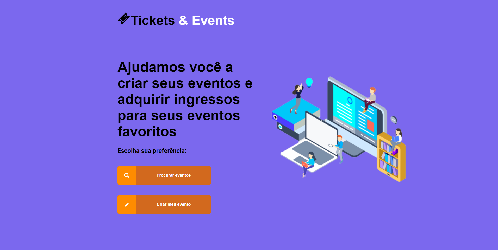
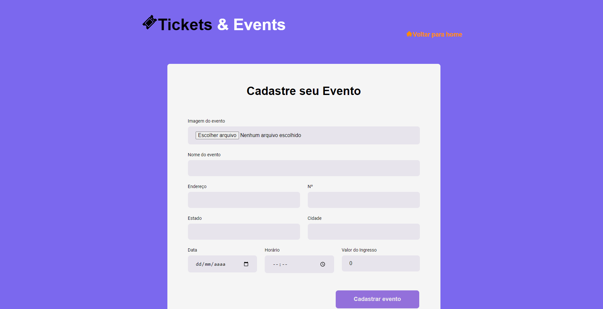
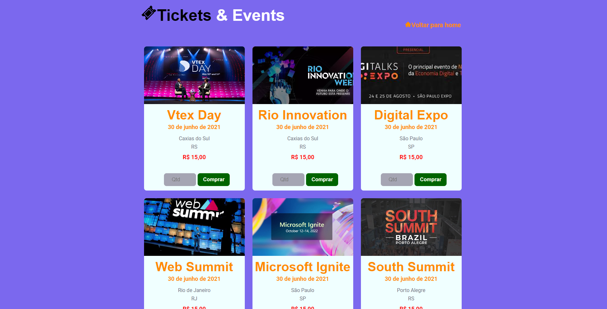

<h3 align="center">
    
    <br><br>
    <b>Tickets & Events</b>
    <br>
</h3>

- [Objetivos](#Objetivos)
- [Resultados](#resultados)
- [Tecnologias Utilizadas](#tecnologias-utilizadas)
- [Instalação](#Instalação)


<a id="Objetivos"></a>

## :bookmark: Objetivos

O projeto teve como objetivo desenvolver um site de eventos, no qual é possível cadastrar seu evento e comprar ingressos para outros eventos.

<a id="resultados"></a>

## :heavy_check_mark: :computer: Resultados

<h3 align="center">Pagina de Home</h3>
<h1 align="center">
    
</h1>

<h3 align="center">Pagina de criação de eventos</h3>
<h1 align="center">
    
</h1>

<h3 align="center">Pagina de listagem e compra de ingressos</h3>
<h1 align="center">
    
</h1>

## :heavy_check_mark: :computer: Resultado Web

<h1 align="center">
    
</h1>

<a id="tecnologias-utilizadas"></a>

## :rocket: Tecnologias Utilizadas

O projeto foi desenvolvido utilizando as seguintes tecnologias

- [HTML](https://devdocs.io/html/)
- [CSS](https://devdocs.io/css/)
- [JavaScript](https://devdocs.io/javascript/)
- [ReactJS](https://pt-br.reactjs.org/)
- [Typescript](https://www.typescriptlang.org/)
- [AXIOS](https://axios-http.com/ptbr/docs/intro)

<a id="Instalação"></a>

## :fire: Instalação e Uso

1. Faça um clone :

```sh
  $ git clone https://github.com/FelipeSantiniBR/TicketsAndEvents.git
```

2. Executando a Aplicação:

```sh
  # Instale as dependências
  $ npm install or $ yarn

  # Inicie a aplicação web
  $ npm start

  # Inicie o json-server
  $ npm run server
```
